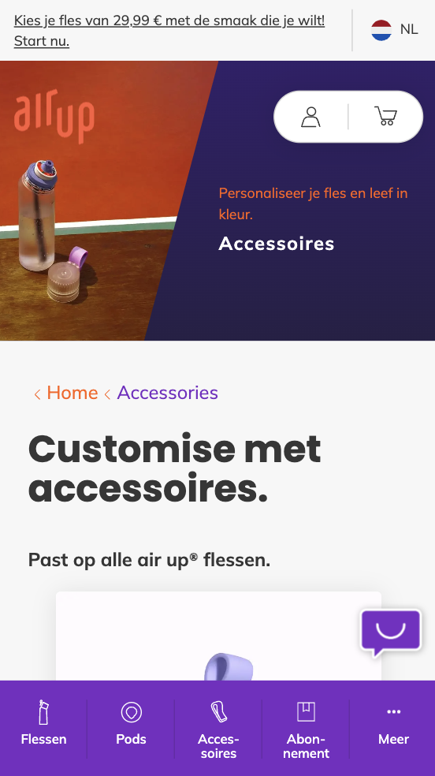

# Procesverslag
Markdown is een simpele manier om HTML te schrijven.  
Markdown cheat cheet: [Hulp bij het schrijven van Markdown](https://github.com/adam-p/markdown-here/wiki/Markdown-Cheatsheet).

Nb. De standaardstructuur en de spartaanse opmaak van de README.md zijn helemaal prima. Het gaat om de inhoud van je procesverslag. Besteedt de tijd voor pracht en praal aan je website.

Nb. Door *open* toe te voegen aan een *details* element kun je deze standaard open zetten. Fijn om dat steeds voor de relevante stuk(ken) te doen.

## Jij

  
uitwerken voor kick-off werkgroep

  ### Auteur:
  Marit Hooijschuur

  #### Je startniveau:
  blauw

  #### Je focus:
  surface plane 
 

## Je website

  
uitwerken voor kick-off werkgroep

  ### Je opdracht:
  link naar de website die je gaat namaken óf de naam:
  "https://nl.air-up.com/pages/not-your-regular-water-bottle-1?bottle=bottle-set-charcoal-grey&pod=flavor-trial-box-vss&step=start"

  #### Screenshot(s) van de eerste pagina (small screen): 
  De naam van de pagina: Homepagina
  

  #### Screenshot(s) van de tweede pagina (small screen):
  De naam van de pagina: Kooppagina
  
 

## Toegankelijkheidstest 1/2 (week 1)

  
uitwerken na test in 2e werkgroep

  ### Bevindingen
  Lijst met je bevindingen die in de test naar voren kwamen:
<li>De screenreader praat snel.</li>
<li>Structuur is logisch van screenreader.</li>
<li>Belangrijk dat een website een duidelijke screenreader heeft.</li>
<li>De WCAG lijst bepaald niet of je website goed is of niet.</li>
<li>Er zijn veel dingen waar je mee rekening moet houden bij het maken van een website.</li>

  Spelen met de screenreader:
  is de structuur logisch? Geeft elk kopje goed aan wat er onder het kopje valt? Geeft elke link goed aan waar naartoe gelinkt wordt? --> De screenreader praat heel snel maar de structuur is wel logisch. Geeft duidelijk aan wat er geselecteerd is en vertelt ook hoe je bijvoorbeeld een knop kunt activeren. 

  WCAG checklist:
  

  
    
    
    
  
  

## Breakdownschets (week 1)

  
uitwerken na afloop 3e werkgroep

  Voordat ik begon aan het coderen, heb ik een breakdownschets gemaakt. Het geeft me een voorproefje van hoe ik alles moet coderen voordat ik aan de slag ga. Dit stappenplan helpt me georganiseerd te blijven en eventuele problemen vroeg te spotten. Kortom, het maken van een breakdownschets is super handig, zodat het overzichtelijk blijft en direct een basis is voor mijn site. 

  ### de hele pagina: 
  
  

  ### dynamisch deel (bijv menu): 
  

## Voortgang 1 (week 2)

  
uitwerken voor 1e voortgang

  ### Stand van zaken
  hier dit ging goed & dit was lastig (neem ook screenshots op van delen van je website en code)
  Ik was begonnen aan de homepagina van mijn site. Deze heb ik opgemaakt met sections. In een van de sections moet een dropdown menu komen. Ik had op het internet gezocht naar hoe dit moest en een tutorial gevolgd. Ik had precies alle stappen gevolgd maar bij mij werkte die niet zoals het hoort. Zie hieronder voor de screenshots van mijn code. Ik heb de code weggehaald en ben verder gaan werken aan de rest van de pagina. 

--> mijn drop down menu geprobeerd maar werkte niet. 
  
  
  

Voor de rest verliep alles goed en als ik vragen had kon ik terecht bij de docent. 

  ### Agenda voor meeting (14 september 2023)
  Tijdens deze meeting ben ik samen met mijn groepje en de docent gaan zitten. Wij hebben de onderstaande agenda tijdens de werkgroepen niet echt gebruikt. 

  | student 1      | student 2          | student 3    | student 4        |
  | ---            | ---                | ---          | ---              |
  | dit bespreken  | en dit             | en ik dit    | en dan ik dat    |
  | en dat ook nog | dit als er tijd is | nog een punt | dit wil ik zeker |
  | ...            | ...                | ...          | ...              |

  ### Verslag van meeting
  Tijdens de eerste meeting met de docent en andere studenten heb ik de vragen van andere studenten
  bekeken en erachter komen hoe hun het oplossen. Dit was erg handig ook voor mij, omdat ik wellicht
  dezelfde problemen tegen ga komen. Daarna heb ik mijn eigen werk laten zien en een aantal vragen
  gesteld waarmee ik vast liep. Denk aan het maken van een dropdown. Ik kreeg te horen dat ik heel goed op weg was en gewoon zo door moest gaan!
Bevindingen tijdens meeting:
  - Goed opweg, gewoon zo door gaan.
  - Op sommige plekken wel nog gebruik van classes, maar dat is tot nu toe wel prima gebruikt, ofwel niet te veel. 
  - Het liefst de classes wel wegwerken. 

  ### Na afloop van meeting
  Na de meeting ben ik verder gaan werken. Ik kreeg te horen dat ik goed op weg was, dus ben lekker verder gaan werken. Ik ga nu de classes wegwerken, aangezien ik er daar nog aardig wat van in heb staan, die vervangen kunnen worden. Voor de rest werk ik verder en bereid ik me voor op het 2e voortganggesprek. 

## Voortgang 2 (week 3 - 21 september 2023)

  
uitwerken voor 2e voortgang

  ### Stand van zaken
  Het gaat verrassend goed. Ben van plan na het weekend te beginnen aan mijn tweede site en de surface planes. Ook heb ik mijn feedback verwerkt, door de classes allemaal weg te hebben gewerkt. 

  ### Agenda voor meeting
  samen met je groepje opstellen. Wij hebben de onderstaande agenda tijdens de werkgroepen niet echt gebruikt. 

  | student 1      | student 2          | student 3    | student 4        |
  | ---            | ---                | ---          | ---              |
  | dit bespreken  | en dit             | en ik dit    | en dan ik dat    |
  | en dat ook nog | dit als er tijd is | nog een punt | dit wil ik zeker |
  | ...            | ...                | ...          | ...              |

  ### Verslag van meeting
  De grootste uitkomst van mijn feedback moment is dat ik beter voor responsive kon gaan dan voor de surface planes. Ik heb dus besloten om toch voor responsive te gaan. Voor de rest zag mijn site er goed uit. 

  ### Na afloop van meeting
  Na het feedbackmoment ben ik direct aan de slag gegaan met het afmaken van de mobiele versie van de site, zodat ik daarna kan beginnen aan het responsive maken van mijn site. 

## Toegankelijkheidstest 2/2 (week 4)

  
uitwerken na test in 9e werkgroep

  Ik heb de test niet in de 9e werkgroep gemaakt, omdat ik en mijn maatje graag eerst nog wat meer content op onze site wilden hebben staan. We hebben samen in het weekend de test gedaan. 

  --> hier de test screenshots 
  WCAG checklist:
  

  
    
    
    
  
  

  ### Bevindingen
  Lijst met je bevindingen die in de test naar voren kwamen (geef ook aan wat er verbeterd is):
--> hier de bevindingen
- afbeeldingen hebben betere beschrijving nodig.
- mijn website geeft af en toe fouten aan in de html pagina's, maar zonder geldige reden. Dit was in de les ook en toen vroeg ik het aan de studentasssistent. Die kwam er ook niet uit, maar wist ze wel weg te krijgen, maar nu komen de fouten weer terug. 
- Als ik mijn site verticaal maak op mobiel, werkt de navigatie niet. 
- video heeft nog geen alt.

Spelen met screenreader:
Ook heb ik nog extra getest of de screenreader op mijn site goed werkt. Als ik mijn voiceover aanzet, vertelt de screenreader netjes alles wat er op mijn pagina te vinden is. Ook begint de screenreader goed met de navigatie. Wel merk ik dat ik sommige afbeeldingen niet goed heb genoemd, waardoor het voor onduidelijkheid zal kunnen zorgen. Hierbij ga ik de alt dus aanpassen. Als ik op Command, Option, Control druk en met de pijlen naar boven en beneden ga, leest de screenreader alles netjes voor. 

## Voortgang 3 (week 4 - 28 september)

  
uitwerken voor 3e voortgang

  ### Stand van zaken
  In de laatste les kwam ik aan met direct veel vragen. Ik moet een artikel maken op de accessoires pagina waarbij je de aantallen kan aanpassen door middel van - en +. Ik had gezocht op internet hoe dit moest maar kwam er niet uit. Na het gevraagd te hebben, heb ik voor het artikel van de accesoire met behulp van een form met fieldset het voor elkaar gekregen. 

  ### Agenda voor meeting
  samen met je groepje opstellen. Wij hebben de onderstaande agenda tijdens de werkgroepen niet echt gebruikt. 

  | student 1      | student 2          | student 3    | student 4        |
  | ---            | ---                | ---          | ---              |
  | dit bespreken  | en dit             | en ik dit    | en dan ik dat    |
  | en dat ook nog | dit als er tijd is | nog een punt | dit wil ik zeker |
  | ...            | ...                | ...          | ...              |

  ### Verslag van meeting
  Mijn belangrijkste vraag tijdens deze "meeting" was hoe ik mijn site responsive kan maken. Dit kan door middel van @media en dan het formaat naar keuze. Ook had ik plots 20+ fouten in mijn html pagina's. Ik had samen met de studentassistent ernaar gekeken, maar die zag niks verkeerds in mijn code en begreep er ook niks van. Ze heeft de fouten weggewerkt, maar de reden kon ze niet vinden. 
  

  ### Na afloop van meeting
  Na de meeting ben ik begonnen aan het responsive maken van mijn site. Het gaat bij mijn navigatie nogal wat stroef. Deze moet van onder aan de website naar bovenaan de website. Dat werkt wel, maar deze navigatie boven moet tussen 2 items komen die er standaard staan. Ik had het gevraagd en ik kreeg te horen dat ik moest spelen met de margin aan de linkerkant, zodat het goed uitlijnde, maar hier kom ik niet helemaal uit. 

## Voortgang na de laatste werkgroep (29 september - 3 oktober)

  ### Vrijdag 29 september 
  Vrijdag ben ik verder gaan werken aan mijn site. Ik begon met de main responsive te maken. Het lukte me na zelf proberen, vragen aan klasgenoten en zoeken op het internet nogsteeds niet. Mijn vader kwam me helpen, maar veel kennis over coderen heeft hij niet. Uiteindelijk na 3 uur te proberen, was het me gelukt. Ik heb de sections aangepast en heb een div moeten toevoegen, zodat ik de img en de div naast elkaar kan zetten. 
  
  Ook zit er ineens aan de rechterkant van mijn site een witte balk. Het lijkt wel een margin, maar er zit helemaal niks. De navigatiebalk onder is breder dan de main, maar de navigatiebalk is de goeie volledige breedte. Ik heb op internet gezocht naar de oorzaak, maar op veel antwoorden kwam ik niet. Ik las dat je de meta-name viewport moest aanpassen, maar dat helpt ook niet. Ook heb ik gespeeld met de marges en padding, maar niks blijkt te werken. Als ik de navigatie verwijder, zit de witte streep er ook nog. Het heeft te maken met de @media, want als ik die verwijder is het weg. Deze witte balk is tot nu toe alleen nog op mijn index pagina, maar ik denk dat zodra ik de @media ook toevoeg voor mijn 2e pagina, het daar op gebeurd. 

### Zaterdag 30 september en zondag 1 oktober
  In het weekend was ik erg druk met de deadline voor mijn andere schoolvak en ik had ook de hele dag tenniswedstrijden. Ik heb een lijstje gemaakt met alles wat ik maandag en dinsdag nog wil gaan doen:
  - Drop down maken homepagina
  - Artikel lus verbeteren
  - Micro annimatie maken
  - screenreader bevindingen verbeteren
  - website volledig responsive maken
  Ook heb ik in het weekend mijn volledige README geüpdate. 

### Maandag 2 oktober
Ik ben nu bezig met de drop down op de homepagina, ofwel de micro-annimatie. Ik heb een tutorial stap-voor-stap gevolgd en heb een drop down nu. Wel maakt deze drop down gebruik van divs en classes. Ik ga (als ik nog tijd heb) deze proberen weg te werken en de vormgeving aanpassen, zodat de stijl overeenkomt met die van de AirUp site.

Ik wil wel dat het responsive blijft, dus dat de heading boven de dropdown komt. Dit heb ik gedaan door een div om de heading en drop down heen te plaatsen. 

Ik heb de html code en de css aangepast, zodat het voor mij duidelijker wordt, aangezien ik er niet heel veel van snapte tijdens de tutorial. De JavaScript van de drop down is mij nog niet helemaal duidelijk, dus die wil ik nog eens doornemen en daar annotaties bij toevoegen, zodat het voor mezelf wat duidelijker wordt. 

Ik heb annotaties geschreven bij scripts en ik begrijp het stukken beter. Wel heeft mijn drop down nog een regel zichtbaar als deze gesloten is, terwijl dit wel goed staat in de javascript. Ook heb ik geprobeerd de classes weg te werken, maar dan werkt de javascript niet meer, omdat ik die heb gemaakt met de classes. 

Door middel van display none aan te zetten op de tekst dacht ik het op te lossen, maar dan werkt de javascript niet meer. 

Verder ben ik bezig met het responsive maken van mijn eerste sections op beide pagina's. Ik had wat moeite met de clip-path op de eerste, maar dit is me uiteindelijk gelukt! Ik heb de volledige main van mijn eerste pagina responsive gekregen. Ook de footer is gelukt qua vormgeving en responsiveness. Ook heb ik samen met mijn vader lopen puzzelen hoe ik de navigatie het beste kan maken, zodat als het scherm groter wordt, de navigatiebalk de tekst niet overtreft. Na veel proberen is dit redelijk gelukt, maar ik zie nog wel ruimte voor verbetering qua vormgeving van de nav.

Ik ga als laatste voor vandaag de content van de tweede pagina toevoegen zodat ik die morgen kan vormgeven en responsive maken. 
Morgen is dus de laatste dag en dan ga ik werken aan:
- pagina 2 content vormgeving.
- pagina 2 responsive maken.
- navigatie mooi en responsive proberen te maken.
- code volledig checken.
- screenreader bevindingen aanpassen.

### Dinsdag 3 oktober
Voordat ik aan de slag ga met css voor mijn tweede pagina, ga ik de css goed sorteren, zodat ik alles uiteindelijk snel terug kan vinden. Om de opmaak voor de tweede pagina te maken, heb ik gebruik gemaakt van classes. Dit omdat ik op mijn eerste pagina bijvoorbeeld de tweede section heb, en die heb ik in css een grid gegeven. De tweede section op mijn tweede pagina, neemt dan ook die style aan. Dit moet niet, dus ik heb dit opgelost door classes te gebruiken. Ik neem aan dat dat mag, want tijdens de les toen ik vroeg hoe ik de tweede body background een andere kleur kreeg, ik ook een class aan de body moest geven. 

Na wat stoeien om de artikelen mooi responsive te maken is dit me aardig goed gelukt. Wel krijg ik de button (in mijn winkelwagen) niet in het midden van het artikel. 

Ook kreeg ik doordat ik de 2e section op mijn homepagina al had vormgegeven, kreeg ik dat de 2e section op de tweede pagina dat ook ging doen. Dit moet niet. Deze twee headings moeten gewoon standaard onder elkaar blijven. Ik had geprobeerd met een class om dit te voorkomen maar dit werkte niet. Om dit op te lossen heb ik de section uiteindelijk vervangen door een article. 

Het laatste wat ik nu wil oplossen qua css is de positie van mijn winkelwagen. 

Nu ga ik mijn bevindingen uit de WCAG test en spelen met screenreader toepassen. Ik wil dat de screenreader netjes mijn site voorleest. Ik ga letten op:
- goeie en duidelijke alt voor mijn afbeeldingen en videos. 
- goeie logische volgordes van headings. 
- maar 1 H1 per pagina. 

Nadat ik dit heb gedaan, ga ik mijn code snel checken en vallideren. Weer geeft die dezelfde fouten aan. Maar deze verdwijnen na 2 keer opslaan weer. Ik en de studentassistent komen er allebei niet uit. Ik heb de screenreader nog eens aangezet. De afbeeldingen en videos worden netjes verteld, maar de spans met de class sr-only wordt niet uitgesproken. Ook worden de streeptjes die ik in de alt (voorbeeld_voor_alt) uitgesproken. Dit moet niet dus heb ik in de alt de _ verwijderd. Ook heb ik alle px verwijderd uit mijn css. De classes die er nu nog in staan, moeten blijven vanwege de vormgeving. 

## Eindgesprek (week 5)

  
uitwerken voor eindgesprek

  ### Je uitkomst - karakteristiek screenshots:
  
  
  
  
  
  
  
  
  
  
  
  
  

  ### Dit ging goed/Heb ik geleerd: 
  
Werken met de @media ging me verrassend goed. Toen ik in de les hoorde dat ik plots beter mijn site responsive kon maken, schoot ik lichtelijk in de stress. Ik had echt geen flauw idee hoe ik met @media screen moest werken, maar dit werd na even wat onderzoeken en uittesten me al snel duidelijk. 

  
Ook heb ik geleerd hoe ik mijn classes kan verminderen. In voorafgaande projecten gebruikte ik voor alles een class om deze vorm te geven, maar dit kan dus ook door de manier hierboven in de afbeelding.

  
  Om bij een groter scherm de sections naast elkaar te krijgen, heb ik gebruik gemaakt van grid. Dit hebben we in de werkgroepen geleerd en de oefeningetjes die we met codepen hebben gedaan in de lessen, hebben me zeker geholpen om dit te begrijpen. 

Al met al ben ik wel erg trots op wat ik heb weten te bereiken. Dit aangezien ik niet zo goed ben in coderen. Ik heb erg veel geleerd, waaronder ook geduld en even rustig kijken naar waar je nou eigenlijk mee bezig bent. Ik wilde het vaak te snel gedaan hebben, waardoor ik de simpelste dingen over het hoofd zag. Ook het coderen zelf gaat me veel gemakkelijker af. Ook heb ik geleerd dat je altijd feedback kunt vragen als je vastloopt. Dit kan op school maar ook online is er veel te vinden, wat je zou kunnen helpen. Wat ik vooral heb geleerd is dat door steeds meer te oefenen, het steeds een beetje beter gaat. 

  ### Dit was lastig/Is niet gelukt:
  
De navigatie is uiteindelijk semi gelukt. Hij is wel responsive, maar de border right en de centrering is me uiteindelijk niet gelukt. Als ik zei dat er geen border right moest zijn, bleef deze wel staan. Ik vond het repsonsive maken erg lastig, maar ben alsnog blij met hoe ver ik gekomen ben. 

  
Graag had ik de fieldset wat verbeterd qua werking. Hij werkt nu wel, maar de button + en - staat er bij voor het uiterlijk, en niet de werking. Toen ik in de les vroeg hoe ik dit kon laten werken, kreeg ik te horen dat ik het uberhaupt helemaal niet zou hoeven toevoegen, maar ik wilde het toch proberen. Uiteindelijk is het uiterlijk op een klein scherm wel gelukt, maar op de grotere wat minder. 

  
Ik had als tip gekregen dat je een span kan toevoegen en deze dan met een class ontzichtbaar kunt maken. Dit heb ik op een aantal plekken gedaan, maar het blijkt niet te werken als ik mijn screenreader laat praten.

## Bronnenlijst

  
continu bijhouden terwijl je werkt

  1. https://www.youtube.com/watch?v=B_wscu_ijwU&t=205s (dropdown menu)
  2. https://blog.hubspot.com/website/center-an-image-in-html#HowtoCenterHorizontally
  3. Docent en studentassistent 

